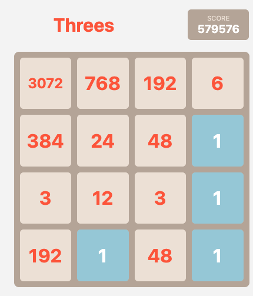
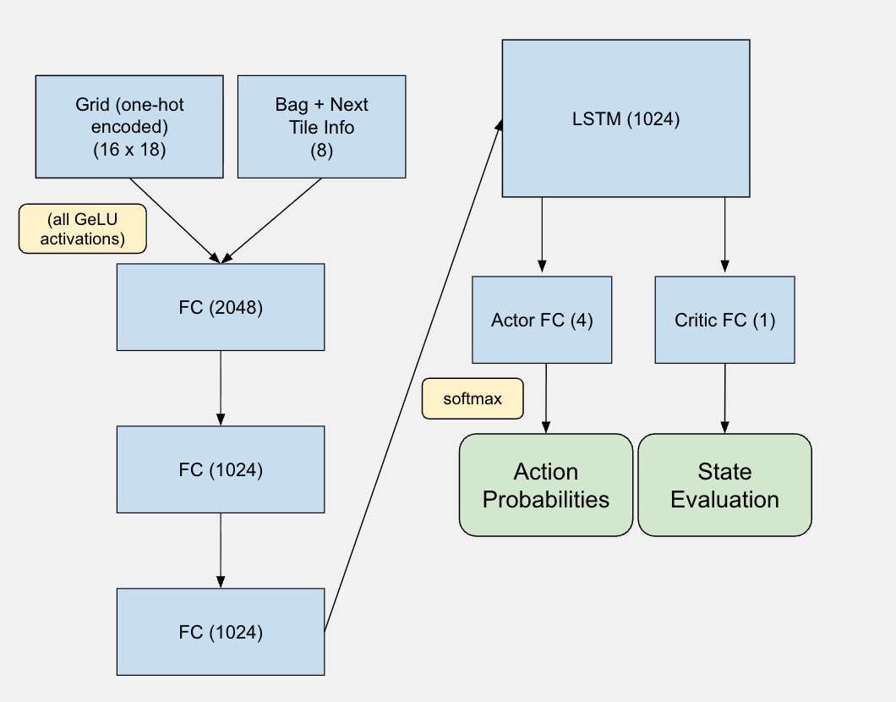

# Threes! AI - Deep Reinforcement Learning

A web-based demonstration of a **deep reinforcement learning agent** trained by PufferLib on the puzzle game Threes!

Unlike previous approaches that relied on pure search algorithms (minimax, expectimax, Monte Carlo Tree Search), this project uses a neural network policy trained with RL.

## How to Play

1. Open `index.html` in a modern browser
2. Use arrow keys or swipe to move tiles
3. Combine 1+2 to make 3, then match equal tiles (3+3, 6+6, etc.)
4. Try to achieve the highest score before the board fills up



## Threes! in AI

Threes! has been a challenging benchmark for game AI since its release in 2014. 

The game is won when a 6,144-tile is created. There are around fifty confirmed players to have achieved this tile.

Additionally, the game will continue until a 12,288-tile is made. Reaching a 12,288-tile is absurdly difficult, with **less than ten players** to have confirmed clears at the time of this. 

It should be noted that this gaming achievement is rated by Challenge Enthusiasts to be [harder than](https://cedb.me/game/87b1ea5b-1e3e-4d72-a900-60b57f84e8f3) Celeste's Farewell Golden, Hollow Knight's Pantheon 5 No Hit, and numerous Touhou Lunatic No Miss No Bombs. 

### 2048 Similarities

Threes is also very similar to the hit game 2048, with a few key changes:
1. Tiles start at 1, 2, 3 (then doubling) instead of 2, 4, 8. As a result, the 2048 equivalent of the Threes final tile (6,144) is 16,384.
2. In Threes!, two different digits are required to make 3, which adds the significant challenge of pairing off colors before they get buried by others.
3. Tiles only slide one space when moved.
4. Players get information about the next tile to spawn, with an equal probability of being a 1, a 2, or a 3.
5. Locations where tiles spawn are less random and can be influenced by player decisions. More details about the spawning mechanisms can be found [here](https://docs.google.com/document/d/1Ra8YbOMz4fMTwAPgeI2Y1_-q7yO1I0XDvAmv2_KKtZk/edit?tab=t.0).

### Previous Work

Others have attempted solving Threes! without the use of deep learning approaches, instead using classic uninformed search algorithms.

- [**N-tuple networks**](https://arxiv.org/abs/2212.11087), reliably reaching 384-tiles
- [**Python expectimax search**](https://github.com/nneonneo/threes-ai) with at least one win 
- [**Go expectimax search**](https://github.com/halfrost/threes-ai) with an impressive 20% winrate 

### Project Approach

Instead of using algorithms that require searching deep into the game tree, I trained an end-to-end recurrent neural network policy using **Proximal Policy Optimization (PPO)** via [PufferLib](https://github.com/PufferAI/PufferLib). The advantages and disadvantages compared to the aforementioned methods are as follows:

**\+** **Hundreds of times faster** (~150 steps per second in JS, thousands in Python) with comparable skill level

**\+** Much greater room for improvement **without increasing runtime** through hyperparameter adjustments, longer training, or adding search

**\-** Searching slightly more time-intensive due to LSTM state having to be re-copied 

As was suggested in the latter two points, the model can also be combined with standard search techniques by using the value function from the Actor Critic implementation as the heuristic. 

## Features

### Game
- Faithful recreation of Threes! mechanics, including the bag and bonus spawning system.
- Smooth tile animations
- Touch/swipe and keyboard controls
- Local high score persistence

### AI
- **Neural Network Policy**: LSTM-based recurrent network that outputs action probabilities
- **Value Function**: Learned state evaluation for search enhancement
- **AI-Hint**: Receive the AI-suggested move. 
- **Auto-Play**: Watch the AI play automatically at adjustable speeds
- **Real-time Inference**: Model runs entirely in-browser via ONNX Runtime Web (WebAssembly)

## Using the AI

The AI controls are in the sidebar:

- **AI Hint**: Get a move recommendation from the neural network
- **Auto AI**: Let the AI play continuously
- **Speed Slider**: Adjust auto-play speed (appears when Auto AI is active)
- **Expectimax**: Enable tree search for stronger play (slower but more accurate)
- **Depth**: Search depth for expectimax (1-3 recommended)

## Technical Details

### Model Architecture
- **Input**: 24-dimensional observation (4x4 grid tile indices + bag state + next tile)
- **Encoder**: Embedding layer with one-hot encoding for tile values
- **Core**: LSTM with 1024 hidden units
- **Heads**: Separate policy (4 actions) and value heads



### Training
- Environment: Custom Threes! implementation in C (via PufferLib)
- Algorithm: PPO with GAE (PufferLib implementation)
- Training: Billions of steps, millions of games played
- Curriculum Training: added 3-6 random large valued tiles to quickly arrive at 'endgamw' tiles

### Inference
- Model exported to ONNX format with LSTM state as explicit inputs/outputs
- Runs in browser using ONNX Runtime Web (WASM backend)
- LSTM state persists across moves for temporal context

## File Structure

```
threes_web/
├── index.html          # Main game page
├── css/style.css       # Styling
├── js/
│   ├── game.js         # Core game logic
│   ├── ui.js           # Rendering and animations
│   ├── ai.js           # Neural network inference
│   ├── expectimax.js   # Tree search implementation
│   ├── main.js         # Application entry point
│   ├── controls.js     # Input handling
│   ├── audio.js        # Sound effects
│   └── storage.js      # Local storage
├── model/
│   └── onnx_model.onnx # Trained model weights
└── assets/             # Icons and sounds
```

## Performance

Without expectimax (pure neural network):
- Inference: ~5-10ms per move

With expectimax (depth 2):
- Inference: ~100-500ms per move
- Improved consistency and higher scores

## Results

I ran the model without any search on 100 games, achieving the following results:

| Highest Tile | Percentage |
| ------------ | ---------- |
| 6144 | 10% |
| 3072 | 60% |
| 1536 | 24% |
| 768 | 3% |
| 12 | 2% |
| 6 | 1% |

The model also successfully reached the 12288-tile around 50 times in training. 

Overall, without direct calculation of any future states, **the model is able to play at the level of an expert player**, but is still well below the world's best.


## Development

No build step required. Simply serve the directory with any HTTP server:

```
make serve
```

Then open `http://localhost:8080` in your browser.

## Credits

- Original Threes! game by [Sirvo LLC](http://asherv.com/threes/)
- Training infrastructure: [PufferLib](https://github.com/PufferAI/PufferLib)
- Browser inference: [ONNX Runtime Web](https://onnxruntime.ai/)

## License

This is a fan project for research and educational purposes. Threes! is a trademark of Sirvo LLC.